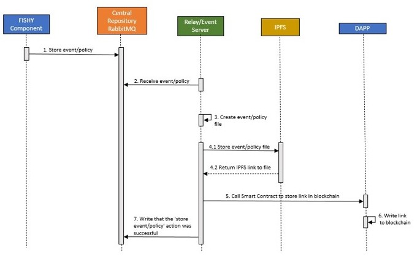

# FISHY Smart Contracts Component Server
 
## Puprose
This is the Smart Contracts component Relay/Event Server, one of the sub-components of the Smart Contracts component of the FISHY project. The Smart Contracts component is used for the validation of the events/reports/policies that the rest of the FISHY components produce. The component stores the details in an IPFS network and the information to retrieve the FISHY events/reports/policies is stored in a Quorum blockchain network.

The figure below shows the end-to-end workflow of the component's functionality.



## Configure Server
Before starting the Server, there are a few environmental variables that need to be set. Create a `.env` file and add the variables, presented in the following table:

| Name | Description | Value |
|  --- |     ---     |  ---  |
| `POSTGRES_HOST` | The name of the postgres | `postgres` |
| `POSTGRES_DB` | The name of the postgres database | `postgres_db` |
| `POSTGRES_USER` | The postgres username | `user` |
| `POSTGRES_PASSWORD` | The postgres password | `password` |
| `FISHY_RABBITMQ_USER` | The username to connect to the FISHY RabbitMQ | `user` |
| `FISHY_RABBITMQ_PASSWORD` | The password to connect to the FISHY RabbitMQ | `password` |
| `FISHY_RABBITMQ_HOST` | The FISHY RabbitMQ host | `fishy-rabbitmq` |
| `FISHY_RABBITMQ_PORT` | The FISHY RabbitMQ port | `5672` |
| `FISHY_RABBITMQ_EXCHANGE` | The FISHY RabbitMQ exchange | `fishy` |
| `FISHY_RABBITMQ_ROUTING_KEY` | The routing key for the FISHY RabbitMQ exchange | `#` |
| `SMART_CONTRACTS_RABBITMQ_USER` | The username to connect to the Smart Contracts RabbitMQ (the FISHY RabbitMQ can be used) | `user` |
| `SMART_CONTRACTS_RABBITMQ_PASSWORD` | The password to connect to the Smart Contracts RabbitMQ (the FISHY RabbitMQ can be used) | `password` |
| `SMART_CONTRACTS_RABBITMQ_HOST` | The Smart Contracts RabbitMQ host (the FISHY RabbitMQ can be used) | `fishy-rabbitmq` |
| `SMART_CONTRACTS_RABBITMQ_PORT` | The Smart Contracts RabbitMQ port (the FISHY RabbitMQ can be used) | `5672` |
| `SMART_CONTRACTS_RABBITMQ_EXCHANGE` | The Smart Contracts RabbitMQ exchange | `sc` |
| `SMART_CONTRACTS_RABBITMQ_ROUTING_KEY` | The routing key for the Smart Contracts RabbitMQ exchange | `sc.res` |
| `CELERY_BROKER_URL` | The URL for the Celery broker (Redis Broker) | `redis://redis:6379` |
| `QUORUM_URL` | The URL of a Quorum node | `http://localhost` |
| `QUORUM_CONTRACT_HOST` | Name of the Quorum node | `node1` |
| `PUBLIC_KEY` | The public key of the Quorum node | `gohugaoITUTFDGKdsfi+gfasy` |
| `IPFS_HOST` | The IPFS host | `ipfs` |
| `IPFS_PORT` | The IPFS port | `5001` | 
| `IPFS_BASE_LINK` | The base link to retrieve a file stored in the IPFS node | `http://127.0.0.1:8080/ipfs` |

## Run and test locally with Docker Compose
The Server is a Django application, packaged in Docker format. To run and test the application locally, a `docker-compose.yml` that starts the Server and a private IPFS node. The Quorum network should already be deployed.

To start the Server:

```bash
docker-compose up --build
```

## Deploy in Kubernetes
The Smart Contracts component Server can also be deployed in a Kubernetes cluster. Before deploying, configure appropriately the environmental variables in the Kubernetes manifests. 

For IPFS, make sure to first run:

```bash
kubectl create secret generic ipfs-swarm-key --from-file=swarm.key
```
To properly configure `swarm.key`, please follow the instructions [here](https://github.com/ahester57/ipfs-private-swarm#21-generate-swarmkey-without-above-repository). 

To deploy, run:

```bash
kubectl apply -f config/k8s
```